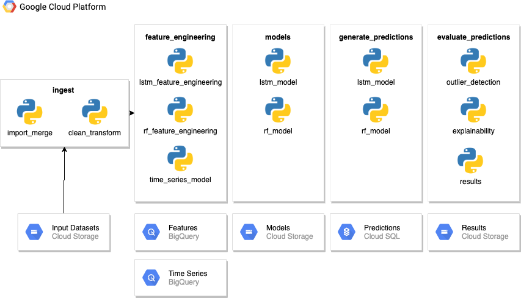

# Kaggle Predict Sales

My work on the [Kaggle Predict Future Sales](https://www.kaggle.com/c/competitive-data-science-predict-future-sales) competition.

## Quickstart

Prior to execution, you will need to:
1. [Install Anaconda](https://www.anaconda.com/)
2. Clone this repo `git clone https://github.com/Tommo565/kaggle-predict-sales`.
3. Create a GCP project, a GCS bucket and subfolders in the bucket according to the `ml_app/config/config.py` file.
4. Create a GCP credentials token with access to GCS & BigQuery and save this into the `ml_app/config` directory as `gcp_token.json`
5. Download and save the [Kaggle Predict Sales Datasets](https://www.kaggle.com/c/competitive-data-science-predict-future-sales/data) into the appropriate GCP buckets according to the config file.
6. Run the steps in **Execution** below.

### ml_app Execution
```bash
cd ml app
conda env create -f environment/environment.yml
conda activate kaggle-predict-sales
python app/main.py run
```

### Tests
```bash
python -m pytest -v
```

## Overview

TODO: What this does at a high level.

## Design & Architecture



## Directory Structure
```
├── README.md
├── analysis
├── data
├── img
└── ml_app
    ├── __init__.py
    ├── analysis
    ├── app
    │   ├── __init__.py
    │   ├── feature_engineering
    │   ├── import_merge
    │   ├── models
    │   └── utils
    ├── config
    │   └── __init__.py
    ├── environment
    ├── main.py
    ├── parameters   
    │   └── __init__.py
    └── test
```

## Processing

Details of the various processing modules... TBC

# To be Explored

* Featuretools
* MLFlow
* CI/CD
* Docker
* Config Management

## TODO

1. Parallelize Resampling
2. Add in shop_id as a feature
3. Export to BQ
4. Run in Cloud

## Useful Links
* [Kaggle Predict Future Sales](https://www.kaggle.com/c/competitive-data-science-predict-future-sales)
* [Kaggle Predict Sales Datasets](https://www.kaggle.com/c/competitive-data-science-predict-future-sales/data)
* [Anaconda](https://www.anaconda.com/)
* [Dask Site](https://dask.org/)
* [Dask Tutorial](https://github.com/dask/dask-tutorial)
* [Dask API Reference](https://docs.dask.org/en/latest/)
* [Pytest](https://docs.pytest.org/en/latest/)

