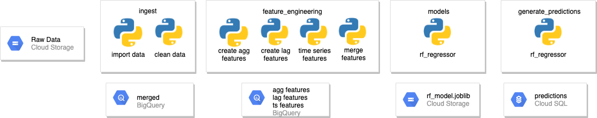

# Kaggle Predict Sales

My work on the [Kaggle Predict Future Sales](https://www.kaggle.com/c/competitive-data-science-predict-future-sales) competition. This is a way for me to explore and share the following concepts:

* Application structure:
    * Environment
    * Configuration
    * Functionality
    * Parameters
    * Data
* Technical Design with [Draw.io](Draw.io)
* Unit Tests with [PyTest](https://docs.pytest.org/en/latest/)
* [Docker (TBC)](https://www.docker.com/)
* Parallel processing with [Dask](https://dask.org/)
* Time Series with [Facebook Prophet](https://facebook.github.io/prophet/)
* Downcasting
* Working in the GCP Cloud Environment
* Using GCP services including Compute Engine, BigQuery, Cloud Storage (GCS)
* Modelling with [MLFlow](https://mlflow.org/) (TBC)
* ML Visualisation with [Yellowbrick](https://www.scikit-yb.org/en/latest/) (TBC)
* Outlier Detection with [PyOD](https://pyod.readthedocs.io/en/latest/)

Technical examples of some of the above concepts are available via the Jupyter Notebooks saved in the `./ml_app/examples` directory.

## Quickstart

Prior to execution, you will need to:
1. [Install Anaconda](https://www.anaconda.com/)
2. Clone this repo `git clone https://github.com/Tommo565/kaggle-predict-sales`.
3. Create a GCP project, a GCS bucket and subfolders in the bucket as per the `[config_example.py](./config/config_example.py)` file. Ensure this is saved as `config.py`
4. [Create a GCP credentials token](https://cloud.google.com/docs/authentication/getting-started) with access to GCS, BigQuery & Compute Engine and save this into the `ml_app/config` directory as `gcp_token.json`
5. Download and save the [Kaggle Predict Sales Datasets](https://www.kaggle.com/c/competitive-data-science-predict-future-sales/data) into the appropriate GCP buckets according to the `config.py` file.
6. Run the steps in **Execution** below.
7. [Add your environment kernel to Jupyter](https://medium.com/@nrk25693/how-to-add-your-conda-environment-to-your-jupyter-notebook-in-just-4-steps-abeab8b8d084) This works for both your local notebook and a cloud based one. 
8. Optional: Set up a GCP Compute Engine instance with as many cores as you can afford that can run a secure Jupyter notebook. [Also add some extra storage](https://cloud.google.com/compute/docs/disks/add-persistent-disk). Some instructions & further reading:
    * [Running Jupyter Notebook on Google Cloud Platform in 15 min](https://towardsdatascience.com/running-jupyter-notebook-in-google-cloud-platform-in-15-min-61e16da34d52)
    * [Security in the Jupyter notebook server](https://jupyter-notebook.readthedocs.io/en/stable/security.html)
    * [Public Notebooks and Security](https://blog.jupyter.org/public-notebooks-and-security-3058c433c884)
    * [Notebook Security in the Cloud](https://medium.com/@datamove/jupyter-notebook-security-in-cloud-1e29bef854f3)

### Execution
```bash
cd ml app
conda env create -f environment/environment.yml
conda activate kaggle-predict-sales
python app/main.py run
```

### Tests
```bash
cd ml_app
python -m pytest -v
```

## Overview

TODO: What this does at a high level.

## Design & Architecture



## Directory Structure
```
├── README.md
├── analysis
├── data
├── img
└── ml_app
    ├── __init__.py
    ├── analysis
    ├── app
    │   ├── __init__.py
    │   ├── feature_engineering
    │   ├── import_merge
    │   ├── models
    │   └── utils
    ├── config
    │   └── __init__.py
    ├── environment
    ├── main.py
    ├── parameters   
    │   └── __init__.py
    └── test
```

## Processing

Details of the various processing modules... TBC

# To be Explored


## Useful Links
* [Kaggle Predict Future Sales](https://www.kaggle.com/c/competitive-data-science-predict-future-sales)
* [Kaggle Predict Sales Datasets](https://www.kaggle.com/c/competitive-data-science-predict-future-sales/data)
* [Anaconda](https://www.anaconda.com/)
* [Guide to Software Testing](https://martinfowler.com/testing/)
* [The 12 Factor app](https://12factor.net/)
* [Pytest](https://docs.pytest.org/en/latest/)
* [Dask Site](https://dask.org/)
* [Dask Tutorial](https://github.com/dask/dask-tutorial)
* [Dask API Reference](https://docs.dask.org/en/latest/)
* [Downcasting in Pandas](https://medium.com/@vincentteyssier/optimizing-the-size-of-a-pandas-dataframe-for-low-memory-environment-5f07db3d72e)
* [Facebook Prophet Quickstart](https://facebook.github.io/prophet/docs/quick_start.html)
* [MLFlow](https://mlflow.org/)
* [Yellowbrick](https://www.scikit-yb.org/en/latest/)
* [Awesome Machine Learning](https://github.com/josephmisiti/awesome-machine-learning)
* [Awesome Production Machine Learning](https://github.com/EthicalML/awesome-production-machine-learning)
* [PyOD](https://pyod.readthedocs.io/en/latest/)
* [PyOD Tutorial](https://www.analyticsvidhya.com/blog/2019/02/outlier-detection-python-pyod/)
